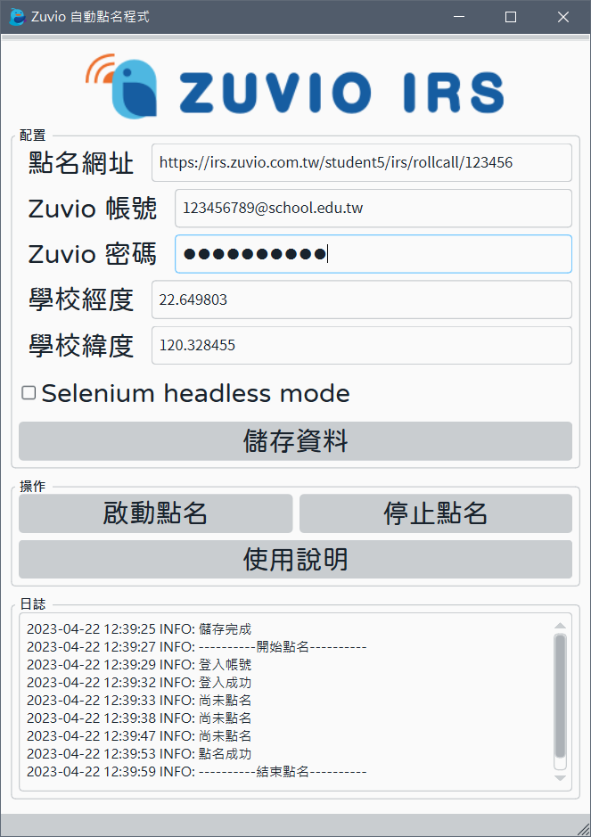

# Zuvio 自動點名



## Overview

這是一個大學生懶得去上課而做的在家自動點名程式。

透過 Selenium 套件模擬瀏覽器動作，自動登入 Zuvio 開啟點名網址，並且隨機重新整理網頁，查看點名是否已經開放。

當課程開啟點名後，將自動點擊按鈕，確認點名成功後退出程式。

## Usage

1. 先到 [ChromeDriver - WebDriver](https://chromedriver.chromium.org/downloads) 下載符合自己作業系統瀏覽器的 `chromedirver.exe` 到本地電腦。
2. 建立乾淨的 Python 虛擬環境來使用。

    ```bash
    $ python -m venv venv
    $ .\venv\Scripts\activate
    ```

3. 安裝 Python 需要用到的依賴套件。

    ```bash
    $ pip install -r requirements.txt
    ```

4. 啟動程式 `zuvio.py`，開啟 UI 介面。

    ```bash
    $ python zuvio.py
    ```

5. 點選`啟動點名`按鈕，開始自動化點名。